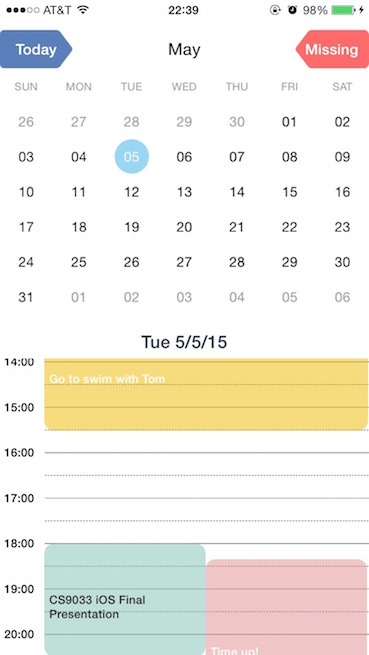
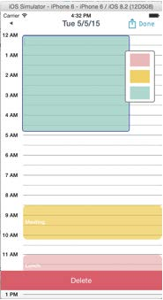
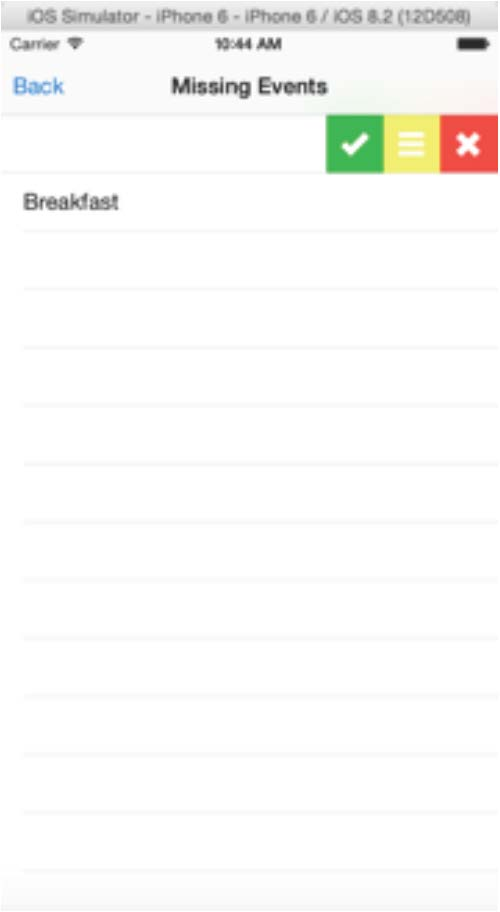
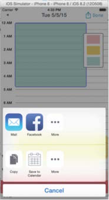
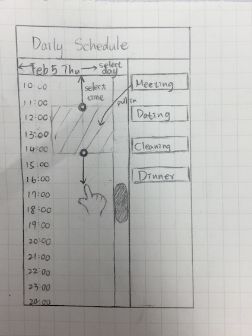

_Last Updated: Fri, Sept 19th, 2015  @ 13:35P_

### Drag Planner

Welcome!

Drag Planner is an iOS app for easy schedule. Users can drag events on the date, pull the bottom of the event to change the duration, and move the event to set the start time. Events will also sync with different could.

Our philosophy is do most what apps can do, instead of forcing users to choose.

____

###Discription

####Event Type

__Red__

The most important event in the app. It comes with a notification and user need to response to that, so user will never miss this event. It will sync with cloud from Parse.com.

__Yellow__

The important event that comes with only alarm. It sync with cloud from Parse.com

__Blue__

The events from Apple Calendar. User need to provide authorization in order to read them. It show in our app because we want user don't worry about making any conflicts in schedule. But users can also modify these events. It will automatically sync with iCloud.

####View Type

__Main__

It combines with two different view. A Month View and a Time Line View.

For Month View, users can easily get the date. We also add the swipe gestures for switching the month.

For Time line view, it shows the today's events for 

__Daily__

This view privide the most straightforward understand for the schedule. Users here can add, delete, modify events by just dragging them.

Share function is also available to different target.

__Missing Events__

Here list the red events that users didn't response to their notification. Users can review here and also check, delete, or reschedule the events.

____

###SCREENSHOTS

____

####Author

 - [Wayne/ Wei Shan](https://github.com/ishawn)
 - [Dong Li](https://github.com/mewhuan)
 - [Lien-Jung Chang](https://github.com/ljc391)

____

###REFERENCE & PROTOTYPE

 - [Prototype](http://invis.io/TQ2EC6LSR)
 - [JTCalendar](https://github.com/jonathantribouharet/JTCalendar)
 - [MACalendar](https://github.com/muhku/calendar-ui)
 - [MGSwipeTable](https://github.com/MortimerGoro/MGSwipeTableCell)
 - [Parse](https://parse.com)

____

###NEXT STEP

 * Debug
 * Re-organize the events as the sketch:

